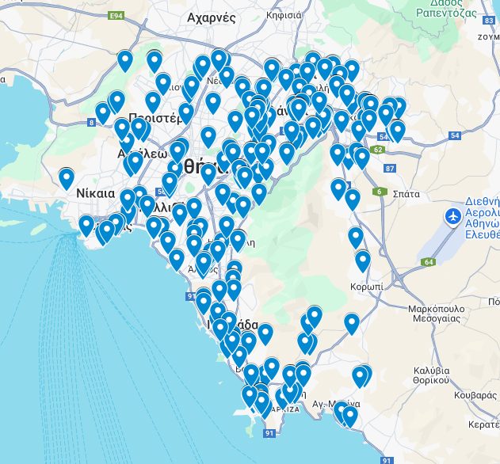
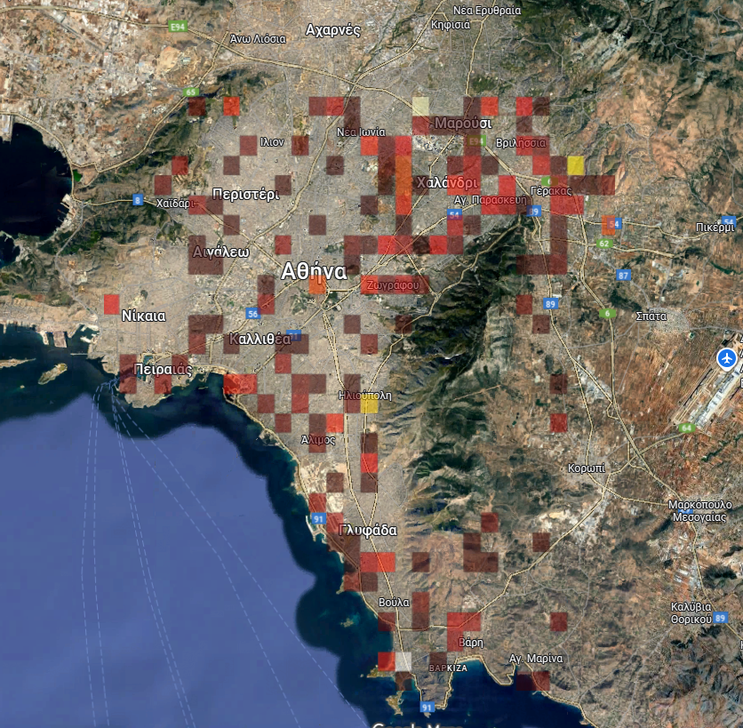
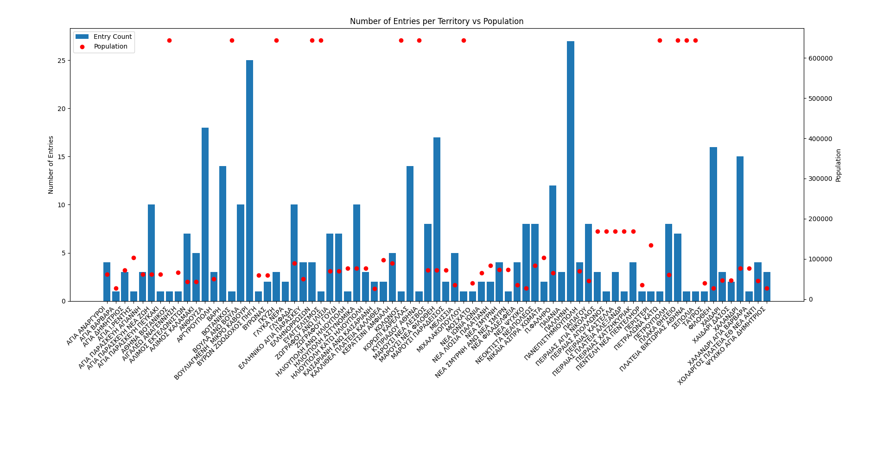

# tennis-fields-athens
Code for discovering all tennis fields in Athens.
For each tennis field, coordinates and area are fetched. The muncipality population as of 2021 is found at
https://www.citypopulation.de/en/greece/athens/ and the data is matched. Therefore, a dataset is created with this form: 

| id | postal_code | territory                  | latitude   | longitude   | municipality | population |
|----|-------------|----------------------------|------------|-------------|--------------|------------|
| 1  | 10441       | ΚΟΛΩΝΟΣ                    | 37.9872999 | 23.7115145  | Athens       | 643449     |
| 2  | 10443       | ΣΕΠΟΛΙΑ                    | 38.0114824 | 23.7150906  | Athens       | 643449     |
| 3  | 10447       | ΑΘΗΝΑ ΒΟΤΑΝΙΚΟΣ             | 37.9848474 | 23.7074422  | Athens       | 643449     |
| 4  | 10558       | ΠΛΑΚΑ ΘΗΣΕΙΟ               | 37.9691227 | 23.7351664  | Athens       | 643449     |
| 5  | 10558       | ΠΛΑΚΑ ΘΗΣΕΙΟ               | 37.969074  | 23.7351476  | Athens       | 643449     |
| 6  | 10558       | ΠΛΑΚΑ ΘΗΣΕΙΟ               | 37.9691014 | 23.7345985  | Athens       | 643449     |
| 7  | 10558       | ΠΛΑΚΑ ΘΗΣΕΙΟ               | 37.9690922 | 23.7347817  | Athens       | 643449     |
| 8  | 10558       | ΠΛΑΚΑ ΘΗΣΕΙΟ               | 37.969083  | 23.734966   | Athens       | 643449     |

Where for each tennis field we have the postal code, territory, coordinates, muncipality and corresponding muncipality population. 
From this dataset, we can derive these plots:

## Location of each tennis field:

The map of each tennis field in athens can be found here: 
https://www.google.com/maps/d/edit?mid=1dY1owMVSw1dLqr0qWuzu6eBLkDjgcQg&usp=sharing

## Tennis field heatmap

We can visualize the density of fields in this heatmap, where dark red corresponds to 1 field and white corresponds to 15+ fields: 

## Tennis fields vs. corresponding muncipality population

Here we can see the number of entries - tennis fields vs the corresponding population. Notice that a population of 640000 (high red dots) corresponds to areas that are in the "Athens" muncipality. 

## Fields per 10k per muncipality 
Using DataWrapper we can visualize the density. In this link https://datawrapper.dwcdn.net/exVK9/1/ the map with the data can be found.

